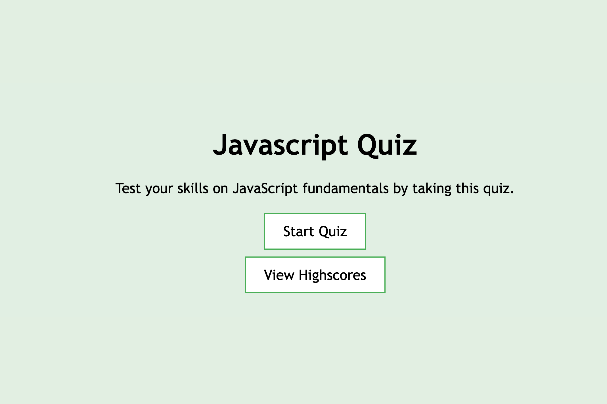

# Javascript Quiz

## Description

The deployed application contains a timed quiz on JavaScript fundamentals that stores high scores with an easy to navigate interface. Unfortunately this project got the best of me and I was unable to finish it due to confusion and poor time management. If I had finished this project, I would be able to demonstrate using basic web API tools in my javascript file which include local storage, timer intervals and setting attributes.

## Table of Contents

- [Installation](#installation)
- [Usage](#usage)
- [Credits](#credits)

## Installation

Below is an example of how you can download the project onto your own device:

1. Open your devices terminal application
2. Locate to the correct file destination that you are wanting to download this project to
3. Clone the repository using this link: 
    ```md
        git clone https://github.com/squrpe/bootcamp-week4challenge.git
    ```
4. You may get prompted to input you github details, thus do so. Otherwise, the project will now be succesfully installed onto your device.

This project contains:
- HTML
- CSS
- Vanilla Javascript

To open and access this project on your personal device, you can download an IDE of your choice but we recommend Visual Studio Code.

After downloading the IDE of your choice you will have access to the raw code. However to host the webpage locally, you will need to download an extension that allows you to open it into your default browser or in your IDE. I recommend Liveserver:


Then using this type of extension, right clicking the file and pressing "Open with Live Server" allows you to open the webpage in your default browser and check out the project from your own device.

## Usage

To access the project's application follow this link: https://github.com/squrpe/bootcamp-week4challenge

Below is what the application looks like:



Click the 'Start Quiz' button to begin!

## Credits

https://www.w3schools.com/:

- Button CSS
- Various Functions

---

## Contact

Lara Grocke - [@my_twitter](twitter.com) - [myemail@email.com](gmail.com)

Project Link - https://github.com/squrpe/bootcamp-week4challenge

Project Deployment - https://squrpe.github.io/bootcamp-week4challenge/
